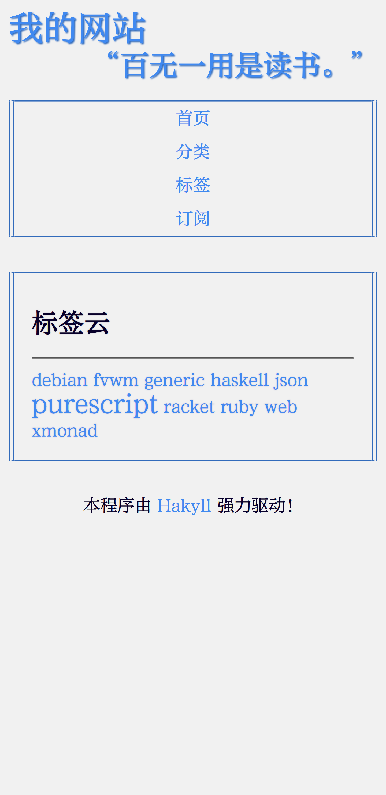
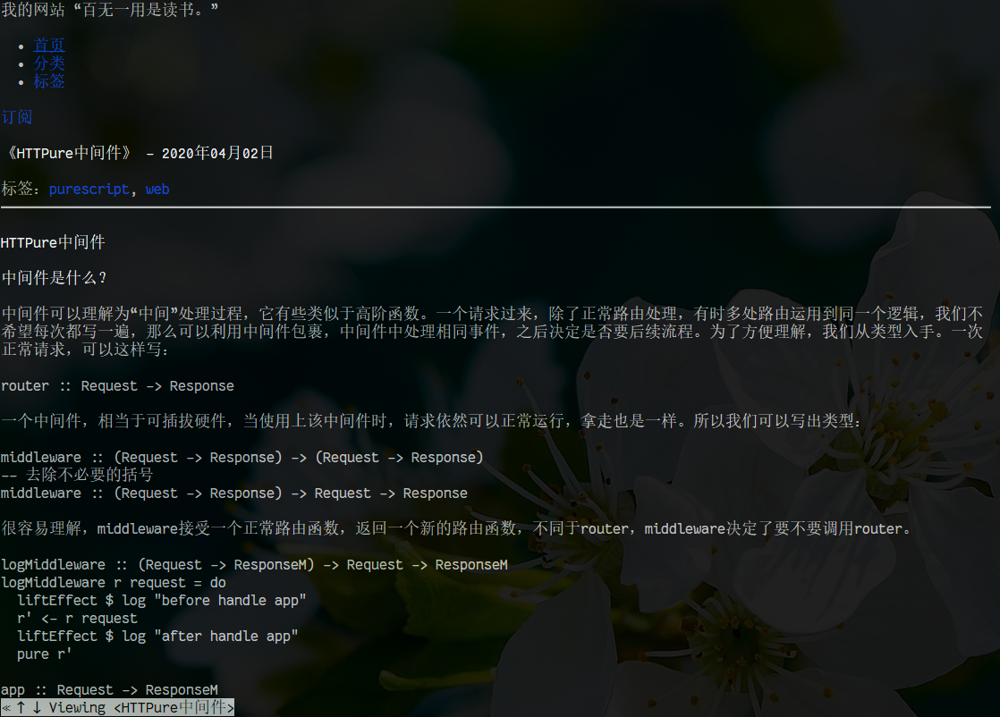

# AONO #

[Hakyll](https://jaspervdj.be/hakyll/)静态博客淡色主题。

[预览及详细说明](https://kalxd.github.io/posts/2020-04-28-guide.html)。

# 特色 #

+ 支持[pandoc](https://pandoc.org/)语法。
+ 提供ATOM格式订阅。
+ 无任何javascript，终端友好。

# 安装使用 #

1. 安装[stack](https://docs.haskellstack.org/en/stable/README/)。
2. 下载或`git clone`代码库。
3. `stack build`。
4. 生成可执行文件`aono`，具体用法跟[Hakyll教程一致](https://jaspervdj.be/hakyll/tutorials/01-installation.html)。
5. 填写配置（可选），在根目录新建config.yml，每一项都有默认值，只填写需要项即可。

# 配置说明 #

| 字段     | 说明                       | 可选 | 默认值       |
|----------|----------------------------|------|--------------|
| title    | 网站名称                   | 是   | Hakyll默认值 |
| desc     | 网站描述，Atom描述         | 是   |              |
| host     | 主机地址                   | 是   | Hakyll默认值 |
| port     | 主机端口                   | 是   | Hakyll默认值 |
| source   | 网站源码地址               | 是   |              |
| output   | 网页输出目录               | 是   | Hakyll默认值 |
| pageSize | 分页，每一页显示多少条文章 | 是   | 23           |

# 截图 #

# 协议 #

+ 程序代码使用GPL v3协议发布。
+ css声明了[方正](http://www.foundertype.com/)字体，为了显示正常，需要去单独安装它们字体。
